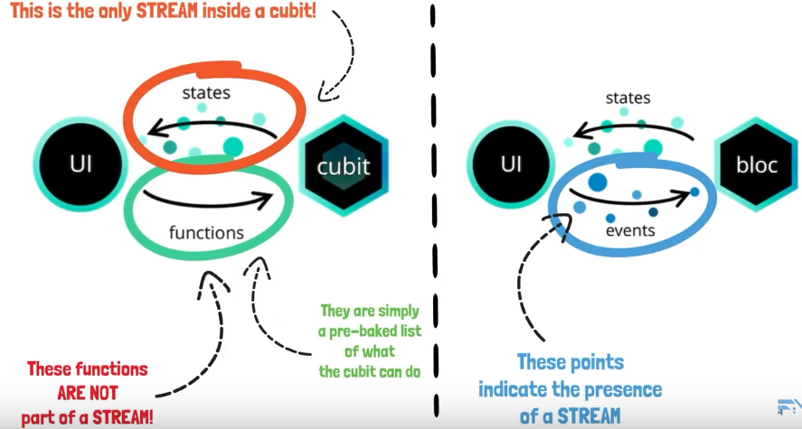

# Flutter Bloc Architecture

[https://www.youtube.com/watch?v=THCkkQ-V1-8&list=PLH6GPEikjUmwO-lzHsovCoYPqPF2AEkSW&index=14&t=4s](https://www.youtube.com/watch?v=THCkkQ-V1-8&list=PLH6GPEikjUmwO-lzHsovCoYPqPF2AEkSW&index=14&t=4s)

# 1. Why BLoc? (Business Logic Component)

Maintainable, Scalable, Organized

What the state of our app is? For every action the app should be in different state.

Understand easily what is happening inside your application.

# 2. Bloc core concept

**Stream**: transport asynchronous data from sender to receiver

```dart
Stream<int> boatStream() async* {
  for (int i = 1; i <= 10; i++) {
    print("SENT boat no. " + i.toString());
    await Future.delayed(Duration(seconds: 2));
    yield i;
  }
}

void main(List<String> args) async {
  Stream<int> stream = boatStream();

  stream.listen((receivedData) {
    print("RECEIVED boat no. " + receivedData.toString());
  });
}
```

**Cubit** is a special kind of component that is based on some functions called by UI that changes states of the stream.

Counter app: Functions: Increment, Decrement

```dart
// CUBIT

import 'package:bloc/bloc.dart';

class CounterCubit extends Cubit<int> {
  CounterCubit() : super(0);

  void increment() => emit(state + 1);
  void decrement() => emit(state - 1);
}

Future<void> main(List<String> args) async {
  final cubit = CounterCubit();

  final streamSubscription = cubit.listen(
      print); //! this subscribes to the cubit state stream and prints the state values emitted by it

  cubit.increment();
  cubit.increment();
  cubit.increment();
  cubit.increment();

  await Future.delayed(Duration
      .zero); //! we use this to not cancel the subscription immediately down here

  await streamSubscription.cancel();
  await cubit.close();
}
```



Bloc receives stream and changes state stream

Cubit receives functions and changes state stream.

```dart
//BLOC

import 'package:bloc/bloc.dart';

enum CounterEvent { increment, decrement }

class CounterBloc extends Bloc<CounterEvent, int> {
  CounterBloc() : super(0);

  @override
  Stream<int> mapEventToState(CounterEvent event) async* {
    switch (event) {
      case CounterEvent.increment:
        yield state + 1;
        break;
      case CounterEvent.decrement:
        yield state - 1;
        break;
    }
    throw UnimplementedError();
  }
}

Future<void> main(List<String> args) async {
  final bloc = CounterBloc();

  final streamSubscription = bloc.listen(print);

  bloc.add(CounterEvent.increment);
  bloc.add(CounterEvent.increment);
  bloc.add(CounterEvent.increment);

  bloc.add(CounterEvent.decrement);
  bloc.add(CounterEvent.decrement);
  bloc.add(CounterEvent.decrement);

  await Future.delayed(Duration
      .zero); //! we use this to not cancel the subscription immediately down here

  await streamSubscription.cancel();
  await bloc.close();
}
```

**When to use Cubit or a bloc?**

Use Bloc/cubit component for every feature of the app.


We can use BLOC as apposed to Cubit but there is no need of using stream of events for making a simple counter feature.

Searching for weather: Use BLOC as you have more control on how to search data.

# 3. Flutter BLOC concepts


Flutter apps are made up of widgets which are classes. 

A tree is used to store parent and children widgets until there are no more widgets in the tree.

**Creating an instance of bloc on every widget you use is very wrong.** Instead use  BlocProvider to provide bloc to all its children. Also known as dependency injection. BlocProvider will provide a single instance of a BLOC and to the subtree below it.

```dart
BlocProvider{
	create: (BuildContext context) => BlocA(),
	child: ChildA()
}
```

The BuildContext of this widget provides information on it's position inside the widget tree.

BlocProvider create the bloc lazily. lazy: false inside blocbrovider to create immediately.

BlocProvider.value() can be passed to transfer blocs from one screen to another.

**BlocBuilder** rebuilds UI when a new state is omitted by bloc or cubit. Only wrap the part that needs to be rebuilt.

```dart
BlocBuilder<BlocA, BlocAState>(
	builder: (context,state){
	// return widget here based on BlocA's state
	}
	buildWhen: (previousState, state){
	//return true/false to determine whether or not to rebuild the widget
	}
)
```

**BlocListener** 

listens to state changes. The listener function is called only once per state as apposed to builder that calls multiple times in same state

```dart
BlocListener<CounterCubit, CounterState>(
        listener: (context, state) {
          if (state.wasIncremented) {
            ScaffoldMessenger.of(context).showSnackBar(SnackBar(
                content: Text('Incremented.'),
                duration: Duration(milliseconds: 300)));
          }
        },
}
```

**BlocConsumer**: combines blocbuilder and bloclistener

**RepositoryProvider**: Identical to BlocProvider except that one provides a unique instance of a BLOC (blocprovider) while the other one provides a unique instance of a repository (repositoryprovider).

**MutiBlocProvider, MultiBlocListener and MultiRepositoryProvider** can handle multiple things.

# 4. BLoC architecture

Skeleton, blueprint and structure to keep code maintainable and scalable.


### Data Layer

Data layer gets data from the internet. Start an application by building **models.**

```dart
class Weather{
	float temp;
	String cityName;
}
```


The OpenWeather API(API lets us to communticate with it without knowing the implementation details) sends data in JSON format. We need to convert it and store it in our model.

A data model must be independent of the API datas.

**The data providers** responsibility is to provide raw data.

```dart
class WeatherApi{
	Future<RawWeather> getRawWeather async{}
	// the return type won't be type of our model but of the typw data u receive.
}
```

The repository: make raw data available to weather by converting it.

```dart
final Weather weather = Weather.fromJSON(rawWeather);
```

### Buisness Logic Layer

BLoC: add catch(error) methods to catch error. Get data from the data layer and prepare it for presentation layer.

### The presentation layer

Widgets, User Inputs, Animations


# 5. BLoC testing


Use equatable library to override equal operator tricking dart to compare by value rather than the memory zone

# 6. BLoC Access and Routing

If we wanna globally provide bloc to many screens

Flutter navigation works by pushing and popping of screens on the stack.

Currently the Countercubit is only available locally to the homescreen.

LOCAL access: providing an instance of a bloc/cubit to a single screen (to its widget tree)

Route access: providing an instance of a bloc/cubit to multiple screens.

**ROUTING:** 3 routing options are available in flutter.

- Anonymous routing
- Named routing
- Generated routing


Providing bloc/cubit instance globally using 3 methods of routing:

1. Anonymous: Use BlocProvider.value(value: existingBloc)

    value: BlocProvider.of<CounterCubit>(context) or context.read<CounterCubit>();  [//use](//use) context of the current screen not of the new screen

2. Named Route Structure:

    

    ```dart
    class _MyAppState extends State<MyApp> {
      final CounterCubit _counterCubit = CounterCubit();

      @override
      Widget build(BuildContext context) {
        return MaterialApp(
          title: 'Flutter Demo',
          debugShowCheckedModeBanner: false,
          theme: ThemeData(
              primarySwatch: Colors.blue,
              visualDensity: VisualDensity.adaptivePlatformDensity),
          routes: {
            '/': (context) => BlocProvider.value(
                  value: _counterCubit,
                  child: HomeScreen(
                    title: 'HomeScreen',
                    color: Colors.redAccent,
                  ),
                ),
            '/second': (context) => BlocProvider.value(
                  value: _counterCubit,
                  child: SecondScreen(
                    title: 'SecondScreen',
                    color: Colors.blueAccent,
                  ),
                ),
            '/third': (context) => BlocProvider.value(
                  value: _counterCubit,
                  child: ThirdScreen(
                    title: 'ThirdScreen',
                    color: Colors.greenAccent,
                  ),
                ),
          },
        );
      }

      @override
      void dispose() {
        _counterCubit.close();
        super.dispose();
      }
    }
    ```

3. Generated Routing
    - Create app_router.dart and use it
    - Wrap materialApp with BlocProvider


# 7. Bloc to Bloc Communication

To explain this we have InternetCubit. when the phone is connected to wifi the counter increases by 1 and decreases when disconnected. We can do this by using:

1. Stream Subscription
2. Bloc Listener

Both method equally good with their pros/cons.


BlocListener manages it's stream subscriptions internally. No stream/memory leaks.


# 8. Flutter BuildContext

The BuildContext handles the location of a widget in the widget tree. 


Instead, they are different contexts. 


Bottom up relationship meaning each context has information about its parent context only.


When pushing from one page to another.


Goes on searching upwards until MaterialApp() widget is found. MaterialApp() conains the Navigator().. The new page will then be added to the Material App Context.


When back button is pressed this new child context is removed

Similar methods:

Navigator.of(context)

BlocProvider.of(context)

Theme.of(context)

Scaffold.of(context)

RandomWidget.of(context)


 Working and Non-working examples


Solving 2:


# 10. Flutter BLoC additions: 6.1

We can create a MultiBlocBuilder = context.watch()


```dart
Builder(
              builder: (context) {
                final counterState = context.watch<CounterCubit>().state;
                final internetState = context.watch<InternetCubit>().state;
                if (internetState is InternetConnected &&
                    internetState.connectionType == ConnectionType.Wifi) {
                  return Text(
                    'Counter: ' +
                        counterState.counterValue.toString() +
                        ' Internet: Wifi',
                    style: Theme.of(context).textTheme.headline6,
                  );
                } else if (internetState is InternetConnected &&
                    internetState.connectionType == ConnectionType.Mobile) {
                  return Text(
                    'Counter: ' +
                        counterState.counterValue.toString() +
                        ' Internet: Mobile',
                    style: Theme.of(context).textTheme.headline6,
                  );
                }
                return Text('Counter: ' +
                    counterState.counterValue.toString() +
                    ' Internet: Disconnected');
              },
            ),
```

Simpler buildWhen function = context.select()  When you wanna rebuild the ui on one simple select condition or value. Use buildWhen for complex conditions.

```dart
Builder(builder: (context) {
              final counterValue = context.select((CounterCubit counterCubit) =>
                  counterCubit.state.counterValue);
              return Text(
                'Counter: ' + counterValue.toString(),
                style: Theme.of(context).textTheme.headline6,
              );
            }),
```

context.read()


# 11. State not updating?

A new state is emitted if the new state is different from the previous state sent to us by the bloc/cubit through the stream.

Dart compares two objects and calls them equal if and only if both are same object  (locations of objects).

```dart
class MyClass extends Equatable{
	final int value;
	
	MyClass({
		this.value
	});

	@override
	List<Object> get props => [value];
}

a = MyClass(value:2);
b = MyClass(value:3);

a == b (True)
if get props => [];
a == b (True) even thought value of a and b are different
```

# 11. Maintaining state with Hydrated Bloc

Store stored data using Hydrated Bloc so that hot restart won't affect it.

Where is data stored?

Local storage of the phone on which the app runs on.

How is data stored?

JSONS

Hydrated bloc uses hive to store and retrieve data which is blazingly fast.

# 12. Debugging apps

While a bloc/cubit is runnit we can use various methods to check what is happening.

Cubit: changes have currentState and nextState. function driven

We can use: **@override onChange** 

```dart
//CounterCubit.dart

@override
  void onChange(Change<CounterState> change) {
    // print("current" +
    //     change.currentState.counterValue.toString() +
    //     ", next " +
    //     change.nextState.counterValue.toString());
    print(change);
    super.onChange(change);
  }
```

```dart
//CounterState.dart

@override
  String toString() =>
      'CounterState(counterValue: $counterValue, wasIncremented: $wasIncremented)';
```

**@override onError():** triggered when there is exception inside cubit

```dart
//CounterCubit.dart
//Add addError() on any method

@override
  Map<String, dynamic> toJson(CounterState state) {
    addError(Exception('Could not write to storage!'), StackTrace.current);
    return state.toMap();
  
@override
  void onError(Object error, StackTrace stackTrace) {
    print('$error, $stackTrace');
    super.onError(error, stackTrace);
  }
```

Bloc: event driven


Inside app, we may have many blocs/cubits. We can use bloc library internal feature that manages observing and debuggling them.

### BlocObserver:


Every state must have toString method overwritten to use this utility function.

```dart
//main.dart

Bloc.observer = AppBlocObserver();
```

```dart
//AppBlocObserver.dart

import 'package:flutter_bloc/flutter_bloc.dart';

class AppBlocObserver extends BlocObserver {
  @override
  void onChange(Cubit cubit, Change change) {
    print(change);
    super.onChange(cubit, change);
  }

  @override
  void onClose(Cubit cubit) {
    // TODO: implement onClose
    super.onClose(cubit);
  }

  @override
  void onCreate(Cubit cubit) {
    print(cubit);
    super.onCreate(cubit);
  }

  @override
  void onError(Cubit cubit, Object error, StackTrace stackTrace) {
    // TODO: implement onError
    super.onError(cubit, error, stackTrace);
  }

  @override
  void onEvent(Bloc bloc, Object event) {
    // TODO: implement onEvent
    super.onEvent(bloc, event);
  }

  @override
  void onTransition(Bloc bloc, Transition transition) {
    // TODO: implement onTransition
    super.onTransition(bloc, transition);
  }
}
```

***The SettingsCubit among the BlocProviders was instantiated after the settings action icon was pressed.***

```dart
BlocProvider<SettingsCubit>(create: (context) => SettingsCubit(), lazy: true,),

//lazy true means the cubit gets created only when our app needs it.
```

# 13. Tips and Tricks (BLoC)


Conventions


